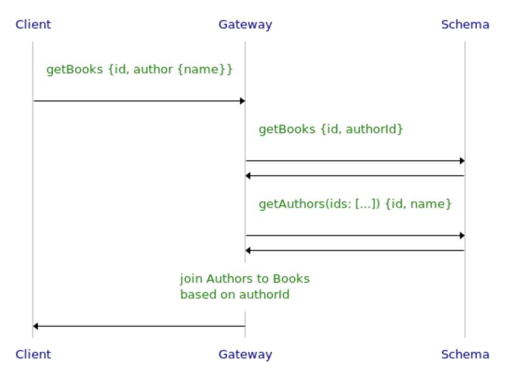

# GraphQL-Join

Join types together in your schema purely with SDL. Let GraphQL-Join handle the rest.

## Example

Say you have a GraphQL schema that looks like the following:

```graphql
type Query {
  getAuthors(ids: [String]): [Author]
  getBooks(ids: [String]): [Book]
}
type Author {
  id: String!
  name: String
}
type Book {
  id: String!
  title: String
  authorId: String
}
```

The `Book` type has a reference to its `Author`, but only in the form of a String. We want to add a new field `Book.author` that points to the actual object, like so:

```graphql
extend type Book {
  author: Author
}
```

Normally you can do this in the backend, but what happens if you don't have access to the original data source? For example, this could be a third party schema, or it could be automatically generated with something like [Hasura](https://hasura.io). You will instead have to join these types together in a gateway, making batched subqueries to the original schema:



<!--
note right of Client: getBooks {id, author {name}}
Client->Gateway:
note right of Gateway: getBooks {id, authorId}
Gateway->Schema:
Schema->Gateway:
note right of Gateway: getAuthors(ids: [...]) {id, name}
Gateway->Schema:
Schema->Gateway:
note over Gateway: join Authors to Books\nbased on authorId
Gateway->Client:
-->

You can implement this pattern in code, but it becomes tedious and hard to read the more joins you add. It's also error-prone and not type safe. As the underlying schema changes, old resolver logic can quietly become obsolete.

GraphQL-Join aims to solve these issues by abstracting away the details. All you need to provide is an SDL string that describes the subquery to make. The following schema transform implements the same pattern, but is much more readable:

```js
import {wrapSchema} from '@graphql-tools/wrap';

const graphqlJoinTransform = new GraphQLJoinTransform({
  typeDefs: `
    extend type Book {
      author: Author
    }
  `,
  resolvers: {
    Book: {
      author: `getAuthors(ids: $authorId) { authorId: id }`,
    },
  },
});

const gatewaySchema = wrapSchema({
  schema: originalSchema,
  transforms: [graphqlJoinTransform],
});
```

The `typeDefs` field describes the overall joins you'd like to add, whereas the `resolvers` field details how to resolve each join. You can see at `Book.author`, we added SDL describing the batched subquery to make to resolve authors for books. Let's look at some of the special syntax:

- `getAuthors` is the name of the batched query. It will retrieve every author for the books in one call to prevent the n+1 problem.
- The `$authorId` variable indicates what field of the parent type (`Book`) we wish to pass to the parameters. Behind the scenes, GraphQL-Join collects all distinct `authorId` fields of each book into a list and filters out any `null` values. The type of `$authorId` is therefore always `[String!]!`. Each field within the parent type has a corresponding variable of the same name you can use in the parameters. They are always distinct, non-null lists of the field's type.
- The `{ authorId: id }` selection indicates which fields in the parent and child to join on. If they are different names, simply use an alias to map them together. Here we are saying to match authors to books where `Book.authorId = Author.id`. You can select more than one field, as long as they are all scalar types. GraphQL-Join will consider a pairing a match if all corresponding fields match.

GraphQL-Join doesn't call this query exactly as written. It simply uses the information within it to generate a custom query for each request. Behind the scenes, GraphQL-Join will strip the aliases and add the user requested fields to the selection set, to get all the required information in one call.

## Joining on Lists

GraphQL-Join supports one-to-one, one-to-many, and many-to-many relationships. In reality, `Book` to `Author` is not one-to-one but many-to-many. Let's see how this could look:

```graphql
type Book {
  id: String!
  title: String
  authorIds: [String]
}
```

To join them together, we can use the following config:

```js
{
  typeDefs: `
    extend type Book {
      authors: [Author!]!
    }
  `,
  resolvers: {
    Book: {
      authors: `getAuthors(ids: $authorIds) { authorIds: id }`
    }
  }
}
```

The query looks very similar to the one-to-one example, but there are a few key differences:

- `$authorIds` is now plural, because it is plural in the `Book` type. Though `Book.authorIds` is a list, GraphQL-Join still passes in a list of type `[String!]!`. It takes the distinct, non-null union across each `authorIds` list as the value for `$authorIds`.
- `{ authorIds: id }` is technically mapping a list type to a scalar type. In this case, GraphQL-Join will consider a pairing a match if the value of `Author.id` is included in `Book.authorIds`. It does not map `null` values, however, as that is commonly used to indicate the absence of a mapping.

You can also add a symmetrical relation to your config like the following:

```js
{
  typeDefs: `
    extend type Author {
      books: [Book!]!
    }
    extend type Book {
      authors: [Author!]!
    }
  `,
  resolvers: {
    Author: {
      books: `getBooksByAuthorIds(ids: $authorIds) { id: authorIds }`
    },
    Book: {
      authors: `getAuthors(ids: $authorIds) { authorIds: id }`
    }
  }
}
```

Note that in this case we have to call a new query `getBooksByAuthorIds` because we don't have access to book ids in `Author`.

As a final note, if you are going to join on a list, then the list can only contain scalar values, and you can only use this one field to join on. GraphQL-Join will not let you use more than one selection if the selection is a list type. This is because it's unclear how to match in this case, as there are multiple options that lead to different results.
